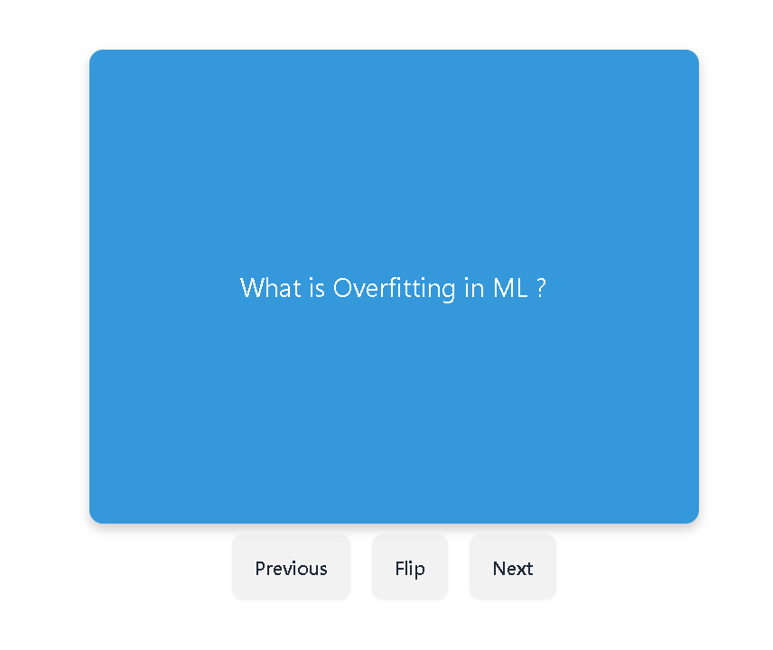

# Flashcard Learning Tool



[Watch the video](https://drive.google.com/file/d/14uvME-3Qc7SpxOG9geqIeaSUZ36T9565/view?usp=sharing)

Find the website live [here](https://flashcard-frontend-en54oi59n-satyajit-patels-projects.vercel.app/).


## 🚀 Overview

The Flashcard Learning Tool is a simple yet powerful React-based web application designed to help users learn and memorize information through interactive flashcards. Whether you're preparing for exams, learning a new language, or simply want to sharpen your memory, this tool provides an effective way to retain information.

## 🎯 Features

### **Flashcard Functionality:**
- **Display Flashcards:** Users can view one flashcard at a time, with a question or term on the front and the corresponding answer or definition on the back.
- **Flip Card:** Users can click on a flashcard to flip it and reveal the answer, making the learning process interactive and engaging.
- **Next/Previous Navigation:** Users can easily navigate through the set of flashcards using the "Next" and "Previous" buttons.

### **Internal Dashboard:**
- **Add Flashcards:** Admins can insert new flashcards with a question and an answer, ensuring the learning material is always up-to-date.
- **Edit Flashcards:** Existing flashcards can be updated to reflect changes in content or correct mistakes.
- **Delete Flashcards:** Admins have the ability to remove flashcards from the set, ensuring only relevant material is presented to users.

### **Database Integration:**
- **MongoDB:** Flashcards are stored in a MongoDB database, allowing for persistent storage and retrieval of data. The application seamlessly interacts with the database to fetch, update, and delete flashcards.

## 🛠️ Technologies Used

- **React:** The front-end of the application is built using React, a popular JavaScript library for building user interfaces.
- **React Router:** For navigating between different components (e.g., flashcard view, admin dashboard) within the application.
- **MongoDB:** A NoSQL database used for storing flashcards, providing a flexible and scalable solution for managing data.
- **Node.js and Express:** The backend is built with Node.js and Express, handling API requests for creating, updating, and deleting flashcards.
- **Tailwind CSS:** A utility-first CSS framework that helps in designing a clean and responsive user interface.
- **Vite:** A modern front-end build tool that provides a fast and optimized development experience.

## 🌟 Benefits

This Flashcard Learning Tool offers several advantages:

- **Interactive Learning:** The flipping mechanism makes learning more engaging and interactive, which can improve information retention.
- **Customizable Content:** Users can easily add, edit, or remove flashcards, ensuring the learning material is always relevant.
- **Easy Navigation:** The intuitive design and navigation make it easy for users to focus on learning without being distracted by complex interfaces.
- **Admin Control:** The internal dashboard allows for efficient management of flashcards, ensuring that only accurate and necessary information is provided.

## 🎓 What You'll Learn

By working with this project, you'll gain hands-on experience with the following concepts:

- **React Hooks:** Learn how to use `useState`, `useEffect`, and `useCallback` to manage state, side effects, and performance optimizations in your React components.
- **React Router:** Understand how to implement routing in a React application to create a seamless user experience.
- **CRUD Operations:** Implement Create, Read, Update, and Delete (CRUD) operations in a full-stack application using MongoDB and Express.
- **Component Design:** Gain experience in designing reusable and responsive components with Tailwind CSS.
- **API Integration:** Learn how to integrate a frontend React application with a backend API for data persistence and management.
- **Conditional Rendering:** Understand how to implement conditional rendering in React to show or hide components based on user actions or state.

## 🚀 Getting Started

### **Installation**

1. **Clone - Install - Set up MongoDB - Run:**
   ```
    git clone https://github.com/satyajit-patel/flashcard-learning-tool.git
    cd flashcard-learning-tool
    npm install
    MONGODB_URI=your_mongodb_connection_string
    npm run dev
   ```

## 🌐 Live Demo

Find the website live [here](https://flashcard-frontend-en54oi59n-satyajit-patels-projects.vercel.app/).

---

## 🌟 Final Thoughts

The Flashcard Learning Tool is designed to make the learning process interactive, efficient, and enjoyable. Whether you're studying for exams, learning new concepts, or simply looking to improve your memory, this tool offers an effective way to practice and retain information. It also provides a great opportunity for developers to learn and implement key web development concepts.

By exploring and contributing to this project, you'll not only refine your coding skills but also make a valuable resource available to learners worldwide. Whether you're new to programming or an experienced developer, there's something to gain from working with this tool.

Happy Learning! 🎉

